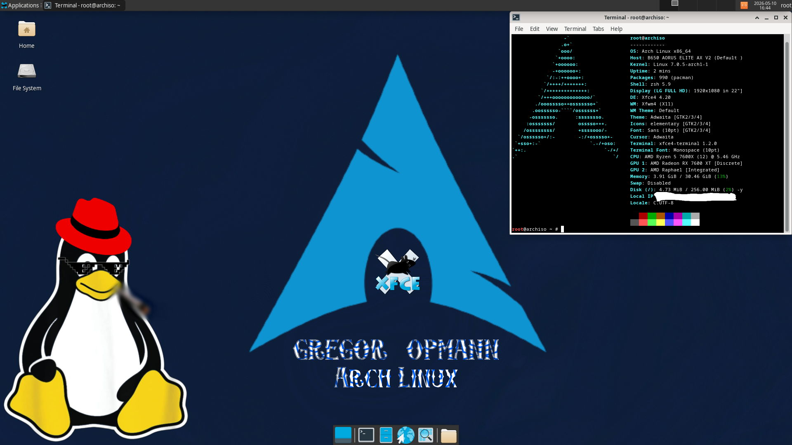

# GregorOpmannOS

## This took me a whole Sunday.

### Use at your own risk, like any Arch Linux distro

*A fairly lightweight XFCE4 Archiso OS for most quick liveboot needs.*

### Security notice

This live environment automatically logs into XFCE4 as root for convenience.

This is NOT intended to be a secure multi-user operating system.
Use responsibly.

> [!WARNING]
> This OS is intended for temporary live sessions only.
> Do not use it as a secure daily-driver environment.

## Minimum requirements

- x86_64 CPU
- 4 GB RAM recommended
- 8 GB USB drive

***ISO size: ~3.8 GB***

## Features

- Lightweight XFCE4 desktop
- Liveboot Arch Linux environment
- Broad filesystem support
- Developer & DevOps tooling
- Networking & diagnostics utilities
- Virtualization support
- Automatic desktop login
- Works well with Ventoy

## SHA256

1f95846771a72d868bf499d9ccafc497db2c946b4f7285076bebdbce1ea9bf1a    GregorOpmannOS-x86_64.iso

## Built with

- archiso
- mkinitcpio
- XFCE4
- systemd
- boredom

## Included software

### Desktop
- XFCE4
- LightDM
- Firefox
- Chromium
- VLC
- LibreOffice

### Development
- Git
- Python
- Neovim
- Docker
- Kubernetes tools
- Terraform
- Ansible

### Networking & Security
- Wireshark
- Nmap
- Tcpdump
- WireGuard
- Lynis
- Hashcat
- ClamAV

### Virtualization
- QEMU
- Virt-Manager

## How to install:

1. Download [**GregorOpmannOS-x86_64.iso Internet Archive Download Page**](https://archive.org/download/gregor-opmann-os-v-1/GregorOpmannOS-v1.tar.gz)
2. Use [**Rufus**](https://rufus.ie/downloads/) to put the image on a **disc/usb that has nothing of value on it** or make a [**Ventoy**](https://www.ventoy.net/en/download.html) **USB** which I personally like better. (A regular 7.4505806 gibibyte USB does just fine, the iso is about half of that). **Problem? Rufus**, probably ... rewrite the image on the USB in **DD Mode**
3. Enter **BIOS** with your PC's BIOS key.
4. Set **Secure Boot** to Off/**Disabled**, as this image is **not Microsoft signed**.
5. Set **boot order**: Make your **USB**, the drive that you have the iso on, the **top** one, **above Windows Boot Manager** or whatever else sh*t you got.
6. **Save** and **Exit BIOS**.
7. In Ventoy or Grub or whatever, select **"GregorOpmannOS-x86_64.iso"**, **"Normal mode"** and **"Arch Linux install medium"** (optional screenreader option, I don't recommend if you're not visually impaired.)
8. Let all the fun stuff run in front of your face, like **"Welcome to Arch Linux"**, do not worry about any **Warning**s or **Error**s (only if it doesn't boot into Arch, don't contact me.)
9. You get automatically thrown into **Xfce4** as the **root** user, which can be pretty scary if you're stupid, you are playing with fire, don't delete random stuff and it won't burn you.

10. Do whatever you want, it's Linux ... Arch, btw. 

The background is somewhere **/usr/local/share/backgrounds/default.png** and /opt/default.png

### Oh no, corruption, whatever will I do?

1. Unplug your USB
2. Reboot (Most modern systems usually go back to the boot order you used before)
3. Format the USB in your preferred file system (NTFS for Windows, ext4 if you're cool)
4. Move on with your day.
