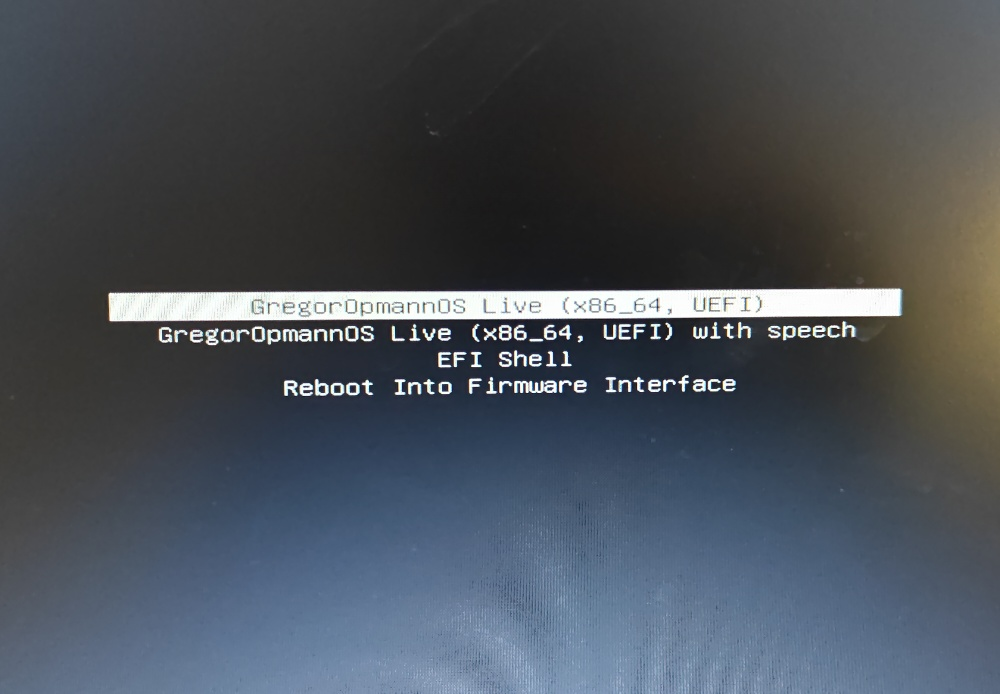

# GregorOpmannOS

## This took me a whole Sunday.

### Use at your own risk, like any Arch Linux distro

*A fairly lightweight XFCE4 Archiso OS for most quick liveboot needs.*

### Security notice

This live environment automatically logs into XFCE4 as root for convenience.
This is NOT intended to be a secure multi-user operating system.
Use responsibly.

> [!WARNING]
> This OS is intended for temporary live sessions only.
> Do not use it as a secure daily-driver environment.
> This live environment automatically logs into XFCE4 as root for convenience.
> This is NOT intended to be a secure multi-user operating system.
> Use responsibly.

## Minimum requirements

- x86_64 CPU
- 4 GB RAM recommended
- 8 GB USB drive

***ISO size: ~3 GB***

## Features

- Lightweight XFCE4 desktop
- Liveboot Arch Linux environment
- Broad filesystem support
- Developer & DevOps tooling
- Networking & diagnostics utilities
- Virtualization support
- Automatic desktop login
- Works well with Ventoy
- Copy to ram

## SHA256

0dae75f8ed7a00545e8c973ec2f54b2e6bb2b52ee60ebb23294a2261351d4464 GregorOpmannOS-x86_64.iso

## Built with

- archiso
- mkinitcpio
- SquashFS
- XFCE4
- systemd
- boredom
- loss of brain cells

## Included software

### Base System
linux (obviously)
linux-firmware
base
base-devel
linux-headers
syslinux
edk2-shell
archiso
mkinitcpio
mkinitcpio-archiso

### CPU / Firmware
amd-ucode
intel-ucode
sof-firmware
linux-firmware-marvell
broadcom-wl

### Desktop Environment (XFCE)
xfce4
xfce4-goodies
lightdm
lightdm-gtk-greeter
alacritty
mousepad

### Networking
networkmanager
network-manager-applet
openssh
wireguard-tools
ethtool
wireless_tools
inetutils

### Audio
pipewire
pipewire-pulse
pavucontrol

### Graphics / GPU Drivers
mesa
vulkan-radeon
xf86-video-amdgpu
xf86-video-intel
xf86-video-nouveau
nvidia-open
nvidia-utils

### Browsers
firefox
chromium

### Multimedia
vlc
gst-plugins-good

### File Systems / Disk Support
ntfs-3g
exfatprogs
dosfstools

### Bluetooth
bluez
bluez-utils

### Office / Documents / Fonts
libreoffice-still-et
libmythes
libreoffice-extension-texmaths
libreoffice-extension-writer2latex
ttf-liberation
gnu-free-fonts
noto-fonts
librsvg
poppler
jre-openjdk

### Terminal / Shell
fish
zsh
grml-zsh-config
starship
bash-completion
tmux

### CLI Utilities
fastfetch
tree
htop
eza
bat
fd
ripgrep
jq
fzf
gdu
ncdu
speedtest-cli
reflector
usbutils
pciutils
wl-clipboard
xclip
stow
man-pages

### Development
git
python
ipython
neovim
ansible
terraform
docker
docker-compose
kubectl
helm
lazygit

### Virtualization
virt-manager
qemu-desktop

### Networking / Diagnostics
nmap
wireshark-qt
mtr
ipcalc
doggo
tcpdump

### Security / Recovery / Forensics
hashcat
clamav
gufw
lynis
testdisk
chntpw
ddrescue
partclone

### Hardware / Storage
smartmontools
nvme-cli
gsmartcontrol
memtest86+

### File Sync / Transfer
rsync
kdeconnect

### Debugging / Sysadmin
strace
pkgstats

### Partitioning / Disk Management
gparted

## How to install:

1. Download [**GregorOpmannOS-x86_64.iso Internet Archive Download Page**]()
2. Use [**Rufus**](https://rufus.ie/downloads/) to put the image on a **disc/usb that has nothing of value on it** or make a [**Ventoy**](https://www.ventoy.net/en/download.html) **USB** which I personally like better. (A regular 7.4505806 gibibyte USB does just fine, the iso is about half of that). **Problem? Rufus**, probably ... rewrite the image on the USB in **DD Mode**
3. Enter **BIOS** with your PC's BIOS key.
4. Set **Secure Boot** to Off/**Disabled**, as this image is **not Microsoft signed**.
5. Set **boot order**: Make your **USB**, the drive that you have the iso on, the **top** one, **above Windows Boot Manager** or whatever else sh*t you got.
6. **Save** and **Exit BIOS**.
7. In Ventoy or Grub or whatever, select **"GregorOpmannOS-x86_64.iso"**, **"Normal mode"** and **"GregorOpmannOS Live (x86_64, UEFI)"** (optional 'with speech' option, I don't recommend if you're not visually impaired.) 
8. Let all the fun stuff run in front of your face, like **"Welcome to GregorOpmannOS Live x86_64"**, easy to miss on a fast system.
9. You get automatically thrown into **Xfce4** as the **root** user, which can be pretty scary if you're stupid.

10. Do whatever you want, it's **Linux** ... **Arch, btw**. 

The background is somewhere **/usr/share/backgrounds/xfce/default.png** and **/opt/default.png** just right click on desktop, go to desktop settings, under backgrounds find **"default.png"**.

Open terminal in full screen cause fastfetch --logo is an ... questionable.
You should be logged in as root@GregorOpmannOS.

### Oh no, corruption, whatever will I do?

1. Unplug your USB
2. Reboot (Most modern systems usually go back to the boot order you used before)
3. Format the USB in your preferred file system (NTFS for Windows, ext4 if you're cool)
4. Move on with your day.
